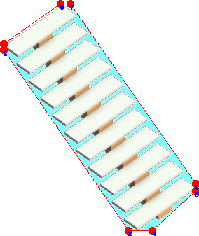

# Octagon Texture Packer

## What this does:  
1. It packing 2D sprites into one texture. similiar tool woudl be [TexturePacker](https://www.codeandweb.com/texturepacker)  
2. Most texture packing tool using 4 point to pack sprites, however it can wast many empty spaces.  

    These empty spaces can cause three problems:   
        a. larger final texture file size.
        b. larger memory footprint when loading into GPU.
        c. empty space wast GPU fillrate.
3. This tool cut images using 8 points instead of 4 points (just like octagon instead of rectangle).   
    *(light blue means wasted empty pixe)*  
    a. rectangle cutting  

      
    
    b. octagon cutting  
      
    

4. Example packing results from regular texure packer vs octagon packer. you can see the result is much more dense.

    a. rectangle packing

        

    b. octagon packing

        

## How to Build
1. prerequisite  
    a. OpenCL library/Headers
    b. cmake
2. clone repository
3. build  
    a. Linux  
    ```bash
        bash> cd packing
        bash> mkdir -p build/make
        bash> cmake ../.. -G "Unix Makefiles" -DCMAKE_BUILD_TYPE=Release
        bash> make
    ```  
    b. Windows  


## How to use
1. prerequisite  
a. OpenCL driver *(usually nvidia or amd graphic driver will preinstall opencl drivers)*  
b. python 3.x  
c. python modules:  
    1. Pillow
2. usage:  
    a. cutting images  
    `python atlas.py -d <sprite folder> -o <cutting output folder>`  
    b. packing images  
    `python mergeAtlas.py -d <cutting output folder> -size <max image size in pixels>`
    c. it will generate packed image plus meta json within <cutting output folder>, it will output multiple images if total size exceed max size defined.  
        e.g atlas-0.png, atlas-0.json
3. packing image meta
```json
{
        "boxMaxX": 135,
        "boxMaxY": 160,
        "boxMinX": -136,
        "boxMinY": -161,
        "file": "stairsOpenSingle_NW.png",
        "pixelToWorld": 1,
        "points": [
            [
                -57,
                160
            ],
            [
                -136,
                105
            ],
            [
                -136,
                96
            ],
            [
                41,
                -161
            ],
            [
                75,
                -161
            ],
            [
                135,
                -106
            ],
            [
                135,
                -96
            ],
            [
                -43,
                160
            ]
        ],
        "reverse": true,
        "uv": [
            [
                0.8911468178954002,
                0.04436383928571429
            ],
            [
                0.8738185255198487,
                0.00027901785714285713
            ],
            [
                0.8709829867674859,
                0.00027901785714285713
            ],
            [
                0.7903276622558286,
                0.09849330357142858
            ],
            [
                0.7903276622558286,
                0.11746651785714286
            ],
            [
                0.80765595463138,
                0.15094866071428573
            ],
            [
                0.8108065532451165,
                0.15094866071428573
            ],
            [
                0.8911468178954002,
                0.05217633928571429
            ]
        ]
    },
```